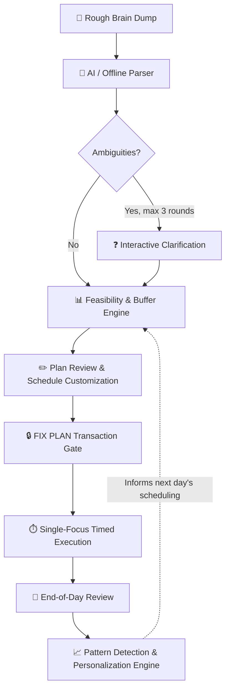

# FlowDesk ⚡

> **Local-First, Privacy-Preserving, AI-Assisted Daily Productivity & Execution Operating System**

[](https://www.typescriptlang.org/)
[](https://nodejs.org/)
[](https://react.dev/)
[](https://vitejs.dev/)
[](https://tailwindcss.com/)
[](https://sqlite.org/)
[](https://capacitorjs.com/)
[](https://vitest.dev/)
[](LICENSE)

FlowDesk transforms unstructured daily thoughts, brain dumps, and chaos into a **realistic, feasibility-checked, and timed daily execution plan**. Built from the ground up on local-first principles, FlowDesk keeps your data entirely under your control on your machine, supports both local AI (Ollama) and cloud AI (OpenRouter) with zero-network offline fallbacks, and enforces single-task focus discipline.

---

## 📑 Table of Contents

- [The FlowDesk Philosophy](#-the-flowdesk-philosophy)
- [The Daily Execution Cycle](#-the-daily-execution-cycle)
- [Key Features](#-key-features)
- [System Architecture](#-system-architecture)
- [Tech Stack](#-tech-stack)
- [Project Structure](#-project-structure)
- [Quick Start](#-quick-start)
  - [Prerequisites](#prerequisites)
  - [One-Click Desktop Launcher (Windows)](#one-click-desktop-launcher-windows)
  - [Manual Development Setup](#manual-development-setup)
- [Android Native App](#-android-native-app)
  - [Installing the APK](#installing-the-apk)
  - [Building from Source](#building-from-source)
  - [In-App Automatic Updates](#in-app-automatic-updates)
  - [Mobile Network Pairing (QR Code)](#mobile-network-pairing-qr-code)
- [Configuration & AI Setup](#-configuration--ai-setup)
  - [Environment Variables](#environment-variables)
  - [Ollama Setup (100% Local AI)](#ollama-setup-100-local-ai)
  - [OpenRouter Setup (Remote AI)](#openrouter-setup-remote-ai)
  - [Offline Quick Split Mode](#offline-quick-split-mode)
- [REST API Reference](#-rest-api-reference)
- [Database & Data Portability](#-database--data-portability)
- [Testing & Quality Assurance](#-testing--quality-assurance)
- [Contributing & License](#-contributing--license)

---

## 💡 The FlowDesk Philosophy

Most task managers are passive wishlists: you add 20 tasks, overestimate what can be done in 8 hours, get overwhelmed, multitask, and carry 15 overdue items into tomorrow. 

**FlowDesk is different:**

1. **AI-Assisted, Human-Controlled**: AI parses rough brain dumps and proposes schedules, but you have 100% editing control before anything is locked in.
2. **Deterministic Feasibility & Buffer Protection**: The backend automatically reserves 10–20% buffer slack, checks day boundaries, and warns you if your day is mathematically overloaded before you commit.
3. **The FIX Transaction Gate**: Ephemeral proposals remain sandbox candidates until you click **FIX PLAN**. Only then are authoritative database records and audit events minted.
4. **Single-Focus Discipline**: The backend enforces a strict concurrency guard. You cannot have two active focus timers simultaneously. No multitasking illusions.
5. **Continuous Learning & Pattern Detection**: FlowDesk measures planned vs. actual execution, calculates your personal duration underestimation bias, tracks peak productive hours, and produces evidence-backed recommendations.
6. **Local-First & Private**: All data lives in your local SQLite database (`flowdesk.sqlite`). OpenRouter API keys never touch the frontend or database.

---

## 🔄 The Daily Execution Cycle



1. **Rough Brain Dump**: Type or paste raw thoughts, messy task fragments, and time constraints.
2. **Understanding**: Extracted by Ollama, OpenRouter, or deterministic rule-based Offline Quick Split into structured candidates (P1–P4 priorities, durations, outcomes).
3. **Clarification**: Targeted, concise questions only for critical ambiguities (capped at 3 rounds).
4. **Schedule & Feasibility**: Generates sequential schedules with pinned commitments and automatic gap buffering.
5. **Plan Review & Customization**: Drag, edit, split, reorder, adjust durations, or exclude tasks. Recalculates metrics in real time.
6. **FIX Gate**: Atomic transaction promoting candidates into real tasks and checklist items.
7. **Execution**: Full-screen focus timer with pause, resume, notes, and task completion triggers.
8. **Daily Review**: Evening reflection recording what worked, what slipped, and real metrics.
9. **Personalization**: The system detects behavioral trends (e.g. *"You consistently underestimate P1 tasks by 35%"*) and offers actionable suggestions.

---

## ✨ Key Features

| Feature | Description |
| :--- | :--- |
| **🧠 Intelligent Brain Dump** | Accepts raw, unformatted text and automatically categorizes tasks, extracts time commitments, deadlines, and deliverables. |
| **⚡ Offline Quick Split** | Zero-network parser that breaks down bullet points and tasks instantly using deterministic rules without requiring any LLM. |
| **🛡️ Concurrency Guard** | Backend-enforced single-timer lock (`TIMER_ALREADY_RUNNING` 409). Multitasking across multiple tabs or devices is cleanly prevented. |
| **📡 Multi-Tab State Sync** | Real-time cross-tab synchronization via `BroadcastChannel` (`flowdesk_state_sync`). Timers and completions sync across all open tabs. |
| **📅 Smart Day Feasibility** | Visual capacity meter indicating whether your workload fits within working hours while preserving mandatory rest buffers. |
| **📱 Native Android App** | Capacitor-powered native Android app with hardware back-button handling, safe-area support, and offline-first caching. |
| **📲 QR Code Mobile Pairing** | Built-in network IP scanner with ranked Wi-Fi detection and dynamic QR code generation to test or connect mobile devices on LAN. |
| **🔄 In-App APK Updates** | Android app checks for new releases on launch with one-tap native APK download and installation trigger. |
| **📦 Portable ZIP Backups** | SHA-256 checksum-verified portable `.zip` backup and atomic restore engine for complete data migration without cloud lock-in. |
| **📊 Behavioral Analytics** | Calculates completion rates, planned vs. actual focus hours, postponement breakdowns, and historical patterns. |
| **🖥️ Dedicated Desktop Mode** | Windows batch script launches FlowDesk in a chromeless, standalone desktop window using Microsoft Edge or Google Chrome app mode. |

---

## 🏗️ System Architecture

```text
┌────────────────────────────────────────────────────────────────────────┐
│                        Client Layer (Vite + React)                     │
│  - Responsive 3-tier layout: Compact (Mobile), Medium, Expanded        │
│  - Zustand State Store + BroadcastChannel cross-tab synchronization    │
│  - Android Native Wrapper via Capacitor 8.5                            │
└───────────────────────────────────▲────────────────────────────────────┘
                                    │ HTTP / JSON (Port 4000)
┌───────────────────────────────────▼────────────────────────────────────┐
│                        Express Backend Server                          │
│  - REST Controllers (/api/v1/...)                                      │
│  - Single Active Focus Timer Concurrency Guard                         │
│  - Deterministic Feasibility & Buffer Calculation Engine               │
│  - Atomic FIX Transaction Coordinator                                  │
│  - In-App APK Update & LAN Discovery Service                           │
│  - SHA-256 Validated ZIP Backup / Restore Engine                       │
└───────────────────▲────────────────────────────────▲───────────────────┘
                    │                                │
┌───────────────────▼───────────┐      ┌─────────────▼───────────────────┐
│     SQLite Database (WAL)     │      │       AI Provider Layer         │
│  - Node native `node:sqlite`  │      │  - Ollama (100% Local LLM)      │
│  - Synchronous Transactions   │      │  - OpenRouter (Remote LLMs)     │
│  - Immutable Task Audit Log   │      │  - Offline Quick Split (No-AI)  │
└───────────────────────────────┘      └─────────────────────────────────┘
```

---

## 💻 Tech Stack

### Backend (`apps/server`)
- **Runtime:** Node.js (>= 20.0, tested on v25)
- **Framework:** Express 4 with modular routers
- **Language:** TypeScript 5.6
- **Database:** SQLite via Node.js native `node:sqlite` (`DatabaseSync`) with Write-Ahead Logging (`WAL`)
- **Validation:** Zod 3.23
- **Archive & Security:** Archiver, Unzipper, Node.js `crypto` (SHA-256)
- **Testing:** Vitest 2.1 + Supertest 7.0 (33 automated unit/integration tests)

### Frontend (`apps/web`)
- **Library:** React 18.3 with Hooks
- **Build Tool:** Vite 5.4
- **Styling:** Tailwind CSS 3.4 with custom utility tokens and safe-area insets
- **State Management:** Zustand 4.5
- **Icons:** Lucide React
- **Mobile Native:** Capacitor 8.5 (Android platform)
- **Utilities:** QRCode generator, BroadcastChannel sync

---

## 📁 Project Structure

```text
flowdesk/
├── apps/
│   ├── server/                         # Express + SQLite Backend
│   │   ├── src/
│   │   │   ├── config.ts               # Environment and runtime configurations
│   │   │   ├── server.ts               # Express initialization & network discovery
│   │   │   ├── db/                     # SQLite database adapter & migrations
│   │   │   ├── domain/                 # Domain logic (types, errors, schedule intelligence)
│   │   │   ├── middleware/             # Error handling & request logging
│   │   │   ├── routes/                 # REST endpoints (brain-dumps, fix, tasks, timers, etc.)
│   │   │   └── services/               # Core business services (AI, timers, scheduler, backup)
│   │   └── tests/                      # Vitest test suites (API, DB, parser, timers, scheduler)
│   │
│   └── web/                            # React + Vite Frontend & Capacitor Native App
│       ├── android/                    # Android Studio native project
│       ├── src/
│       │   ├── api/                    # Typed API client
│       │   ├── components/             # Reusable UI widgets & navigation shells
│       │   ├── screens/                # Primary application screens
│       │   │   ├── TodayDashboard.tsx  # Hero focus widget & today's agenda
│       │   │   ├── BrainDumpScreen.tsx # Raw text capture interface
│       │   │   ├── PlanReviewScreen.tsx# Schedule customizer & feasibility meter
│       │   │   ├── ExecutionScreen.tsx # Fullscreen focus timer & checklist
│       │   │   ├── DailyReviewScreen.tsx# Evening reflection screen
│       │   │   ├── AnalyticsScreen.tsx # Productivity trends & patterns
│       │   │   ├── SettingsScreen.tsx  # AI configs, network pairing & APK downloads
│       │   │   └── BackupScreen.tsx    # ZIP export & restore
│       │   └── stores/                 # Zustand global application store
│       └── capacitor.config.ts         # Capacitor Android build configuration
│
├── docs/                               # Architectural and engineering specifications
│   ├── API.md                          # REST API specification
│   ├── ARCHITECTURE.md                 # System topology & decisions
│   ├── DATA_MODEL.md                   # SQLite schema, tables & indexes
│   ├── DECISIONS.md                    # Architectural Decision Records (ADRs)
│   └── VERIFICATION.md                 # Test matrices & verification criteria
│
├── releases/                           # Packaged Android release APKs & manifests
│   ├── FlowDesk-v1.0.1.apk
│   └── version-manifest.json
│
├── scripts/                            # PowerShell icon and asset generators
├── FlowDesk.bat                        # Windows one-click desktop app launcher
├── FlowDesk.vbs                        # Silent Windows launcher (hides command window)
├── stop-flowdesk.bat                   # Clean server/frontend shutdown utility
├── build-apk.bat                       # Automated Android APK build & release pipeline
├── flowdesk.sqlite                     # Local production SQLite database
└── package.json                        # Root monorepo workspace configuration
```

---

## 🚀 Quick Start

### Prerequisites
- **Node.js**: `v20.0.0` or later ([Download Node.js](https://nodejs.org/))
- **Git**: For cloning the repository
- *(Optional for Local AI)*: [Ollama](https://ollama.ai/)
- *(Optional for Android builds)*: Android SDK & JDK 21

### One-Click Desktop Launcher (Windows)

FlowDesk includes a pre-configured, standalone launcher for Windows:

1. Clone the repository:
   ```bash
   git clone https://github.com/mrprdinesh810-bot/flowdesk.git
   cd flowdesk
   ```
2. Install dependencies:
   ```bash
   npm install
   ```
3. Double-click **`FlowDesk.bat`** (or **`FlowDesk.vbs`** for silent mode).

The launcher will:
- Check if the backend (port `4000`) and frontend (port `3000`) are active; if not, starts them minimized.
- Open FlowDesk in dedicated **Chromeless App Window mode** using Microsoft Edge or Google Chrome (`--app=http://localhost:3000`).

To stop all running FlowDesk background processes at any time, run:
```bat
stop-flowdesk.bat
```

---

### Manual Development Setup

If you prefer running frontend and backend in separate terminals:

#### 1. Install Dependencies
```bash
npm install
```

#### 2. Start the Backend
```bash
npm run dev:server
# Running on http://127.0.0.1:4000
```

#### 3. Start the Frontend
In a new terminal:
```bash
npm run dev:web
# Running on http://localhost:3000
```

#### 4. Access the Application
Open [http://localhost:3000](http://localhost:3000) in your web browser.

---

## 📱 Android Native App

FlowDesk can be compiled into a standalone Android APK using Capacitor.

### Installing the APK
- You can directly install the pre-built APK found in the root directory: **`FlowDesk.apk`** or in `releases/FlowDesk-v1.0.1.apk`.
- Or download it directly from your local FlowDesk server:
  Navigate to **Settings → Mobile App & Pairing** to scan the QR code from your phone or download the latest APK over your Wi-Fi network.

### Building from Source
To compile the Android APK from scratch:

```bat
build-apk.bat
```

This automated script will:
1. Compile the web assets with `npm run build`.
2. Sync assets to the native Android directory with `npx cap sync android`.
3. Invoke the Gradle wrapper (`gradlew.bat assembleDebug`).
4. Archive and version the compiled APK into `releases/` and the public downloads folder.

### In-App Automatic Updates
FlowDesk includes an in-app update checker. Whenever a new APK version is dropped into `releases/version-manifest.json`, the app prompts the user upon launch with release notes and a one-tap direct download button.

---

## ⚙️ Configuration & AI Setup

FlowDesk works completely without external accounts, but you can configure an AI provider in **Settings** or via environment variables.

### Environment Variables
Create a `.env` file in `apps/server/.env` if you wish to pre-configure defaults:

```env
PORT=4000
HOST=127.0.0.1
NODE_ENV=development
DB_PATH=../../flowdesk.sqlite

# Optional Cloud AI
OPENROUTER_API_KEY=your_openrouter_api_key_here
```

### Ollama Setup (100% Local AI)
To run fully offline and private with Ollama:
1. Install [Ollama](https://ollama.ai/) on your machine.
2. Pull your preferred model (e.g. `llama3.2`, `mistral`, or `qwen2.5`):
   ```bash
   ollama pull llama3.2
   ```
3. In FlowDesk, navigate to **Settings → AI Engine**:
   - Provider: **Ollama**
   - Host URL: `http://127.0.0.1:11434`
   - Model Name: `llama3.2`
4. Click **Test AI Connection**.

### OpenRouter Setup (Remote AI)
To use frontier cloud models (Claude 3.5 Sonnet, GPT-4o, DeepSeek, etc.):
1. Get an API key from [OpenRouter](https://openrouter.ai/).
2. In FlowDesk, navigate to **Settings → AI Engine**:
   - Provider: **OpenRouter**
   - API Key: `sk-or-v1-...`
   - Model Name: `anthropic/claude-3.5-sonnet` (or any OpenRouter model identifier)
3. Click **Save Settings**. Your API key is stored server-side only in memory / configuration and never exposed to the frontend.

### Offline Quick Split Mode
If no AI is configured or you have zero internet connectivity, select **Offline Quick Split** on the Brain Dump screen. The system uses deterministic parsing to parse tasks, extract durations, and generate candidates instantaneously.

---

## 🔌 REST API Reference

All endpoints adhere to JSON payloads and are served from `/api/v1/*`.

| Method | Endpoint | Description |
| :--- | :--- | :--- |
| `GET` | `/api/v1/health` | Service health status and version |
| `GET` | `/api/v1/network-info` | Ranked local IPv4 interfaces for mobile pairing |
| `POST` | `/api/v1/brain-dumps` | Ingest raw text and produce task candidates |
| `GET` | `/api/v1/brain-dumps/:id` | Retrieve brain dump and associated candidates |
| `POST` | `/api/v1/candidates/:id/clarify` | Submit clarification answer for a candidate |
| `PUT` | `/api/v1/candidates/:id` | Update candidate properties (time, priority, inclusion) |
| `POST` | `/api/v1/schedule/recalculate` | Compute timeline, capacity, and buffer feasibility |
| `POST` | `/api/v1/fix` | **Transactional Gate**: Persist approved plan into real tasks |
| `GET` | `/api/v1/tasks` | Query tasks by date (`?date=YYYY-MM-DD`) and status |
| `GET` | `/api/v1/tasks/:id` | Get task details, checklists, and timer history |
| `PUT` | `/api/v1/tasks/:id` | Update task details |
| `POST` | `/api/v1/tasks/:id/status` | Transition task status (`completed`, `postponed`, `missed`) |
| `POST` | `/api/v1/tasks/:id/postpone` | Postpone task to a future target date |
| `POST` | `/api/v1/checklists/:id/toggle` | Check/uncheck a checklist item |
| `GET` | `/api/v1/timers/active` | Get currently running focus timer session |
| `POST` | `/api/v1/timers/start` | Start focus session (rejects with 409 if another runs) |
| `POST` | `/api/v1/timers/pause` | Pause active focus session |
| `POST` | `/api/v1/timers/resume` | Resume paused session |
| `POST` | `/api/v1/timers/complete` | Complete focus session and record actual duration |
| `POST` | `/api/v1/timers/switch` | Switch active timer from one task to another |
| `GET` | `/api/v1/reviews/:date` | Get or initialize daily review summary for date |
| `POST` | `/api/v1/reviews/:date` | Submit daily reflection and outcome status |
| `GET` | `/api/v1/analytics` | Compute completion rate, estimation accuracy, and hours |
| `GET` | `/api/v1/patterns` | Retrieve detected behavioral patterns with evidence |
| `GET` | `/api/v1/settings` | Retrieve user configuration settings |
| `PUT` | `/api/v1/settings` | Update user settings |
| `POST` | `/api/v1/ai/test` | Test connectivity to Ollama or OpenRouter |
| `GET` | `/api/v1/backup/export` | Download portable `.zip` backup with SHA-256 hash |
| `POST` | `/api/v1/backup/import` | Upload, verify checksum, and restore SQLite database |
| `GET` | `/api/v1/app-update/manifest` | Get latest Android APK release metadata |
| `GET` | `/api/v1/app-update/download` | Stream and download versioned Android APK binary |

For complete schemas and error codes, refer to [docs/API.md](file:///h:/taskmanagerapp/docs/API.md).

---

## 💾 Database & Data Portability

FlowDesk stores all data inside a single SQLite database file: `flowdesk.sqlite`.

### Key Tables
- `brain_dumps`: Immutable raw text input ledger
- `candidates`: Ephemeral planning candidates before FIX
- `tasks`: Authoritative scheduled and executed tasks
- `checklist_items`: Actionable sub-steps linked to tasks
- `timer_sessions`: High-precision UTC focus session intervals
- `task_events`: Immutable audit trail of every state transition
- `daily_reviews`: End-of-day reflections and metrics
- `patterns` & `recommendations`: Behavioral intelligence models

### Disaster-Proof Backups
From **Settings → Backup & Restore**, you can export a standardized portable `.zip` backup containing:
- `database.sqlite`
- `manifest.json` (format version, schema version, creation timestamp)
- `metadata.json` (SHA-256 integrity checksum)

Restoration strictly inspects the package, guards against path traversal, validates the SHA-256 checksum, verifies SQLite integrity, and performs an atomic swap.

---

## 🧪 Testing & Quality Assurance

FlowDesk includes a comprehensive test suite covering SQLite migrations, concurrency guards, scheduling intelligence, parser fallbacks, and REST API integration.

To run the test suite:
```bash
npm test
```

### Test Coverage Highlights
- ✅ **Single Timer Concurrency:** Rejects concurrent session starts across clients.
- ✅ **FIX Transaction Atomicity:** Verifies candidate promotion, rollback on error, and task event logging.
- ✅ **Buffer & Feasibility Engine:** Ensures buffer protection rules and day boundary calculations pass deterministic checks.
- ✅ **AI & Offline Parser:** Tests structured JSON generation and graceful fallback to offline heuristic splitting.
- ✅ **Backup Integrity:** Tests export streaming, SHA-256 hash validation, and safe restore swap.

---

## 🤝 Contributing & License

Contributions, feedback, and pull requests are welcome!

1. Fork the repository
2. Create a feature branch: `git checkout -b feature/amazing-feature`
3. Commit your changes: `git commit -m "feat: add amazing feature"`
4. Push to the branch: `git push origin feature/amazing-feature`
5. Open a Pull Request

Distributed under the **MIT License**. See `LICENSE` for more information.

---

<p align="center">
  <b>FlowDesk</b> — <i>Reclaim your day, one focused block at a time.</i>
</p>
